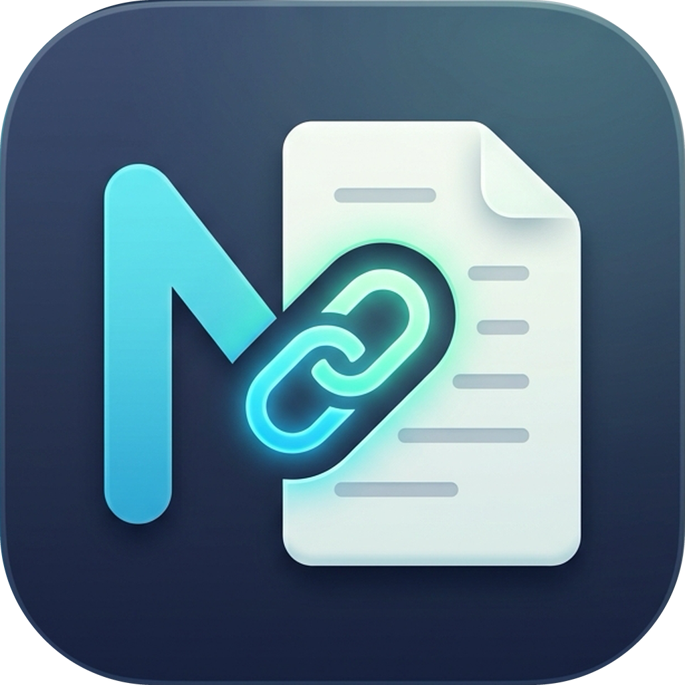

# 🚀 MarkFlow

> **High-Performance Cross-Platform Markdown & Mermaid Workspace**  
> Native Desktop (Windows, macOS, Linux) + In-Browser Docker Deployment.



---

## ⚡ Highlights

- **Extreme Resource Efficiency:**
  - Desktop Native (Tauri v2 + Rust): **< 35MB RAM**, **< 0.25s cold start**, **~15MB bundle**.
  - Web Docker (Go 1.23+): **< 25MB container image**, **< 20MB RAM**.
- **Zero-Lag Typing Engine:**
  - Powered by **CodeMirror 6** with DOM row virtualization.
  - Mermaid diagram compilation offloaded to background Web Worker with SHA-256 hash caching.
- **Side Link Preview Inspector:**
  - Click any internal `.md` reference or external web link to open a clean 3rd-column side inspector without losing your active document.
- **VSCode Ergonomics + Vim Mode:**
  - Full VSCode keyboard shortcuts (`Ctrl+S`, `Ctrl+P`, `Ctrl+B`, `Ctrl+W`).
  - 1-click **Vim Mode** toggle in the top bar.
- **Multi-Tab Workspace & File Explorer:**
  - Open multiple documents with dirty state indicators and unsaved warnings.
  - Hierarchical file tree with create, rename, and delete actions.

---

## 🛠️ Quick Start

### 1. Web / Docker Mode (Simplest & Fast)

Run the production multi-stage container with your local markdown folder mounted:

```bash
# Using Docker Compose
docker compose up -d

# Or using plain Docker
docker run -d --name markflow -p 8080:8080 -v $(pwd)/workspace:/workspace markflow:latest
```

Open your browser at: **`http://localhost:8080`**

### 2. Native Desktop App (Tauri v2 - Windows, macOS, Linux)

```bash
cd markflow

# Install frontend dependencies
pnpm install

# Run Desktop app in development mode
pnpm tauri dev

# Build production installer (dmg on macOS, deb/AppImage on Linux, msi/exe on Windows)
pnpm tauri build
```

### 3. Local Development Mode

```bash
# 1. Start frontend development server
pnpm dev

# 2. Or start the Go backend server (port 8080)
make server
```

---

## ⌨️ Keyboard Shortcuts

| Shortcut (Win/Linux) | Shortcut (macOS) | Action |
|---|---|---|
| `Ctrl + P` | `Cmd + P` | **Quick Switcher** (Fuzzy search & jump to file) |
| `Ctrl + S` | `Cmd + S` | **Save active document** |
| `Ctrl + W` | `Cmd + W` | **Close active tab** |
| `Ctrl + B` | `Cmd + B` | **Toggle File Explorer sidebar** |
| `Ctrl + \` | `Cmd + \` | **Toggle Side Link Preview Inspector** |
| `Ctrl + 1` | `Cmd + 1` | **Editor only view** |
| `Ctrl + 2` | `Cmd + 2` | **Split view (Editor + Live Preview)** |
| `Ctrl + 3` | `Cmd + 3` | **Reader only view** |

---

## 🏛️ Architecture & Shared Codebase

MarkFlow uses the **Adapter Pattern** (`FileSystemAdapter`) so that **95% of the codebase is 100% shared**:

```
markflow/
├── Dockerfile                  # Multi-stage build (< 25MB final image)
├── docker-compose.yml          # Container configuration
├── Makefile                    # Developer shortcuts
├── src-tauri/                  # Desktop Backend (Rust + Tauri v2)
│   ├── Cargo.toml
│   ├── src/main.rs             # Native file I/O commands
│   └── icons/icon.png          # App icon
├── server-go/                  # Docker Web Backend (Go stdlib)
│   ├── go.mod
│   └── main.go                 # Static file server + REST file API
└── src/                        # 100% Unified Frontend (React 19 + TypeScript)
    ├── adapters/               # TauriAdapter, HttpAdapter, MockAdapter
    ├── components/
    │   ├── editor/             # CodeMirror 6 + Vim mode
    │   ├── preview/            # Markdown & Mermaid with hash caching
    │   ├── explorer/           # File tree & Quick switcher
    │   └── sidepanel/          # Side link preview drawer
    └── stores/                 # Tab, Workspace, and Settings store
```
