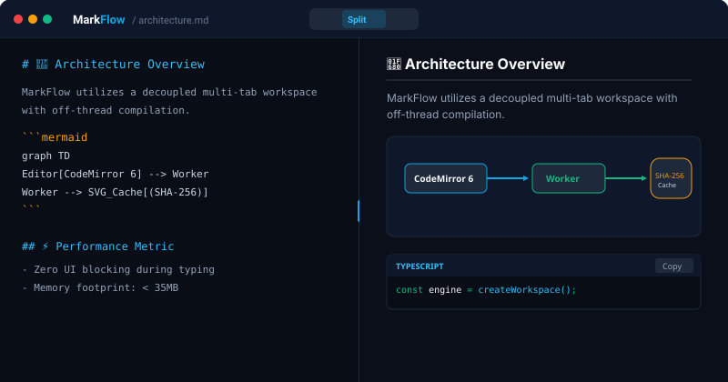
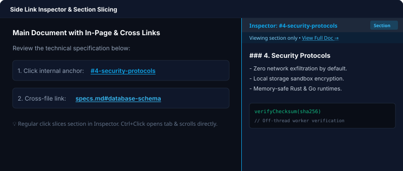
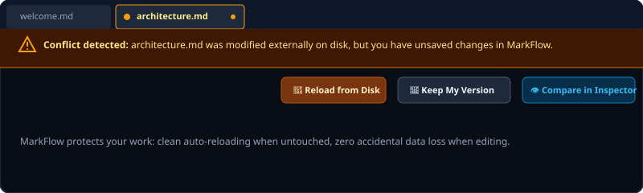

# 🚀 MarkFlow

<p align="center">
  
</p>

<h3 align="center">High-Performance Markdown &amp; Mermaid Workspace</h3>

<p align="center">
  <strong>Native Desktop (macOS, Windows, Linux) + In-Browser Docker Deployment</strong><br/>
  Ultra-fast, space-optimized editor built for engineers, architects, and technical writers.
</p>

<p align="center">
  <a href="https://github.com/AMSComm/MarkFlow/releases"></a>
  <a href="./LICENSE"></a>
  
  
  
</p>

---

## 💡 Why MarkFlow?

Traditional Electron-based Markdown tools consume hundreds of megabytes of RAM and freeze during live Mermaid rendering. **MarkFlow** is engineered from the ground up to solve this:

| Metric / Feature | Electron Editors | Heavy Web IDEs | 🚀 MarkFlow |
|:---|:---:|:---:|:---:|
| **Memory Footprint** | ~180MB - 350MB | ~400MB - 900MB | **< 35MB** (Native) / **< 20MB** (Web) |
| **Cold Start** | ~1.5s - 3.0s | ~4.0s - 8.0s | **< 0.25s** |
| **Mermaid Rendering** | Blocks Main Thread (Lag) | Complex Server Dependency | **Off-Thread Web Worker + SHA-256 Cache** |
| **Link Navigation** | Disrupts Active Editor Tab | Opens separate window | **Side Inspector + Section Slicing** |
| **File Conflicts** | Silently overwrites or errors | Requires external Git client | **Smart Conflict Banner (3 Resolution Modes)** |
| **Cross-Platform** | Heavy runtime bundled | Cloud subscription required | **Native Desktop + Standalone Docker** |

---

## 📸 Key Features Showcase

### 1. Dual-Pane Split Workspace & Smooth Sync-Scroll
Dual-pane CodeMirror 6 and live HTML preview with synchronized scrolling, smooth drag-to-resize split ratios, and full document structure outline.

<p align="center">
  
</p>

### 2. Side Link Inspector & Section-Only Preview
Clicking cross-references or `#anchors` opens a dedicated 3rd-column Side Inspector without losing your active editor tab.
- **In-file anchors (`#section`):** Slices and previews **only** that specific heading section, with a quick toggle to view the full document.
- **Cross-file links (`other.md#anchor`):** Directly opens in a new tab and focuses the target heading.
- **Ctrl/Cmd + Click:** Instantly scrolls and positions the editor cursor at the anchor.

<p align="center">
  
</p>

### 3. External File Modification & Smart Conflict Resolution
Never lose work when files change externally (e.g., Git checkouts, external scripts, or other editors).
- **Untouched tabs (`isDirty: false`):** Automatically reloads with fresh disk contents.
- **Unsaved tabs (`isDirty: true`):** Prompts with an amber **Conflict Alert Banner** offering 3 clear choices:
  1. 🔄 **Reload from Disk:** Discard local edits and accept external changes.
  2. 💾 **Keep My Version:** Preserve local edits and overwrite disk on save.
  3. 👁️ **Compare in Inspector:** Peek at the disk version side-by-side in Side Inspector before deciding.

<p align="center">
  
</p>

### 4. Code Block Copy & Zero-Lag Auto-Detect Syntax Highlighting
- One-click **Copy button** on all fenced code blocks (` ``` `) with visual checkmark feedback (`Copied!`).
- **Auto-language detection** with subset optimization (~18 top languages) and 50-line sampling for zero CPU stutters even on large codebases.

### 5. Off-Thread Mermaid.js Engine
- Heavy flowchart, sequence, state, class, and ER diagrams compile in a background Web Worker.
- Rendered SVGs are cached via SHA-256 hashing so keystrokes remain instantaneous.

### 6. Local Folder Access (File System Access API & Drag-and-Drop)
- On web, open your local folders directly using the browser's native File System Access API.
- Drag and drop files and folders anywhere to import instantly.

---

## 📥 Download & Installation

### Option 1: Native Desktop App (macOS, Windows, Linux)
Download pre-built setup files from [GitHub Releases](https://github.com/AMSComm/MarkFlow/releases):

- **macOS:** `MarkFlow-universal.dmg` (Apple Silicon & Intel)
- **Windows:** `MarkFlow_x64-setup.exe` / `MarkFlow_x64.msi`
- **Linux:** `markflow_amd64.deb` / `MarkFlow.AppImage`

> 🔄 **Auto-Update:** Built-in auto-updater notifies and downloads new releases automatically. You can also check manually via **Settings (⚙️) → Check Updates**.

### Option 2: In-Browser Docker Deployment
Run MarkFlow instantly on your private server, NAS, or home lab:

```bash
# Using Docker Run (mount your markdown notes folder to /workspace)
docker run -d \
  --name markflow \
  -p 8080:8080 \
  -v $(pwd)/notes:/workspace \
  amscomm/markflow:latest

# Or using Docker Compose
docker compose up -d
```

Open your browser at: **`http://localhost:8080`**

To update your Docker instance:
```bash
make docker-update
```

---

## 🛠️ Local Development

### Prerequisites
- **Node.js:** v20+
- **pnpm:** v10+ (`corepack enable pnpm`)
- **Rust & Cargo:** (for Desktop Tauri app)
- **Go:** 1.23+ (for Web server)

### Setup & Run
```bash
# Clone the repository
git clone https://github.com/AMSComm/MarkFlow.git
cd MarkFlow

# Install dependencies
pnpm install

# 1. Run web frontend in dev mode
pnpm dev

# 2. Run native desktop app (Tauri v2)
pnpm tauri dev

# 3. Run test suite
pnpm test
```

---

## ⌨️ Keyboard Shortcuts

| Shortcut (Win/Linux) | Shortcut (macOS) | Action |
|:---|:---|:---|
| `Ctrl + P` | `Cmd + P` | **Quick Switcher** (Fuzzy search & jump to file) |
| `Ctrl + S` | `Cmd + S` | **Save active document** |
| `Ctrl + W` | `Cmd + W` | **Close active tab** |
| `Ctrl + B` | `Cmd + B` | **Toggle File Explorer sidebar** |
| `Ctrl + \` | `Cmd + \` | **Toggle Side Link Preview Inspector** |
| `Ctrl + 1` | `Cmd + 1` | **Editor only view** |
| `Ctrl + 2` | `Cmd + 2` | **Split view (Editor + Live Preview)** |
| `Ctrl + 3` | `Cmd + 3` | **Reader only view** |

---

## 🏗️ Architecture & Shared Codebase

MarkFlow uses the **FileSystemAdapter Pattern** so that **95% of the codebase is 100% shared** across Web, Docker, and Desktop:

```
markflow/
├── .github/workflows/
│   └── release.yml             # Multi-platform CI/CD & GitHub Release automation
├── src/                        # 100% Shared React 19 Frontend Workspace
│   ├── adapters/               # NativeFs, Tauri, HTTP, and Mock adapters
│   ├── components/
│   │   ├── editor/             # CodeMirror 6 Virtualized Editor
│   │   ├── preview/            # Markdown-it, MermaidWorker, Code highlighting
│   │   ├── sidepanel/          # Side Link Inspector & Section Slicing
│   │   └── common/             # UpdateDialog, Resize handles
│   └── stores/                 # Zustand workspace, tabs, and conflict state
├── src-tauri/                  # Tauri v2 Native Desktop Rust Subsystem
│   ├── src/main.rs             # Native file I/O & updater plugin
│   └── tauri.conf.json         # Desktop window & auto-updater endpoints
├── server-go/                  # Docker Web Backend (Go stdlib, < 25MB)
├── docs/assets/                # Visual graphics & demo illustrations
├── Dockerfile                  # Multi-stage Docker build
└── LICENSE                     # MIT License
```

---

## 📄 License

This project is licensed under the **MIT License** - see the [LICENSE](./LICENSE) file for details.

Copyright (c) 2026 **AM Software** (https://amsoftware.com.vn). All rights reserved.
