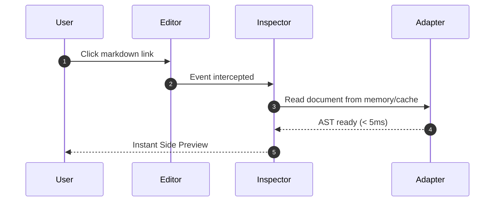

# 📊 Sample Architecture Diagram

This is a sub-document opened in the **Side Inspector** without interrupting the main tab!

---

## Sequence Flow

```mermaid
sequenceDiagram
    autonumber
    User->>Editor: Click markdown link
    Editor->>Inspector: Event intercepted
    Inspector->>Adapter: Read document from memory/cache
    Adapter-->>Inspector: AST ready (< 5ms)
    Inspector-->>User: Instant Side Preview
```

[Return to Welcome](./welcome.md)
