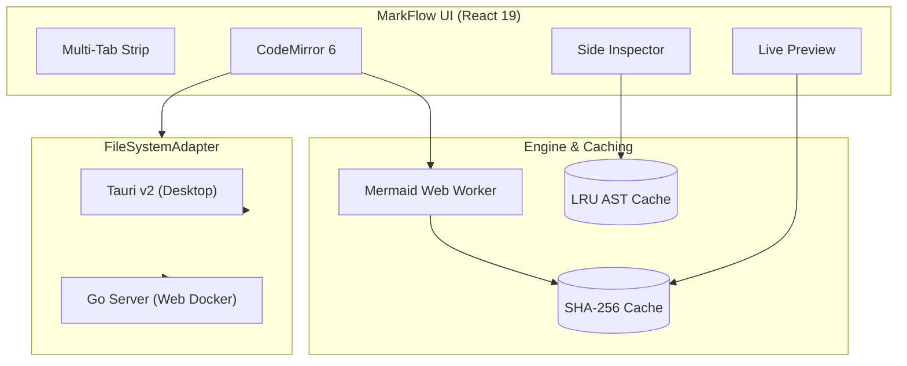

# 🚀 Welcome to MarkFlow Workspace

MarkFlow is your ultra-lightweight, high-performance Markdown & Mermaid workspace.

---

## ⚡ Zero-Lag Editing & Live Mermaid Diagram

---

## 🔗 Side Link Preview Test
Click any link below to test the instant **Side Inspector** without leaving this document:
- [Sample Mermaid Architecture](./sample-diagram.md)
- [External Documentation](https://mermaid.js.org)

---

## 📋 Features Checklist
- [x] Runs natively on Windows, macOS, Linux (Tauri v2)
- [x] Runs in-browser via Docker (< 25MB container, < 15MB RAM)
- [x] Zero keystroke latency on 10,000-line documents (CodeMirror 6)
- [x] Instant side link preview
- [x] Multi-tab document workspace
- [x] Space-optimized UI with collapsible panels
- [x] VSCode shortcuts + Vim Mode toggle
